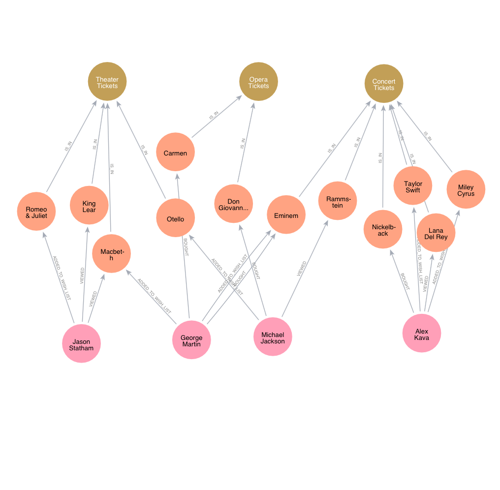
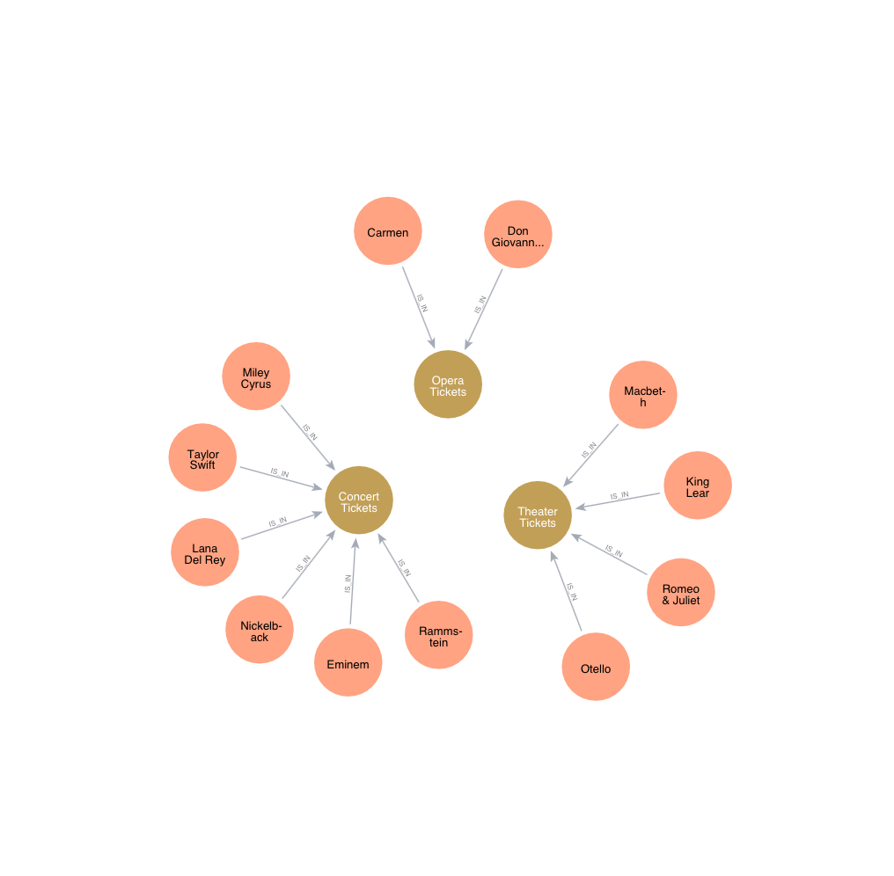
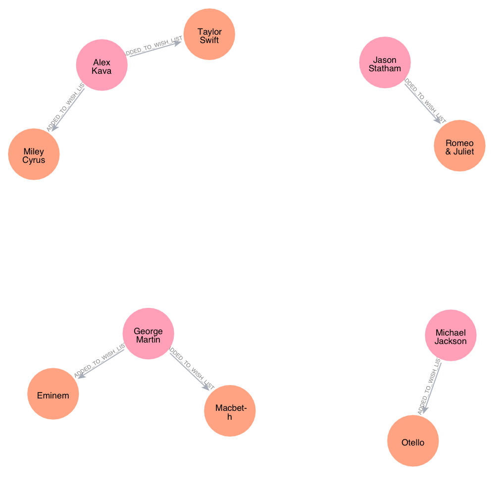
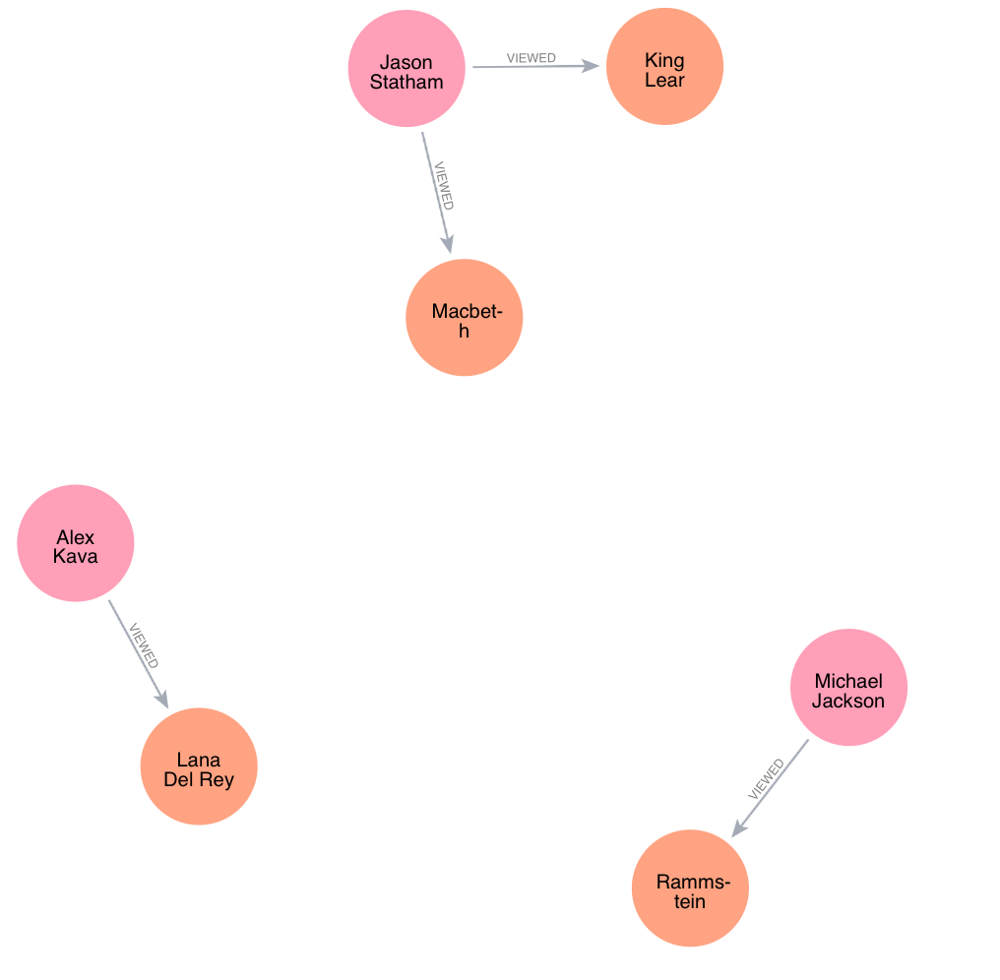

# Przetwarzanie danych w chmurach obliczeniowych

### Projekt zaliczeniowy - Aleksander Bartoszek

Aplikacja webowa wykorzystująca grafową bazę danych

### Korzystanie z aplikacji

serwer aplikacji jest hostowany w środowisku chmurowym Oracle Cloud i jest dostępny pod adresem

`http://130.61.93.16:5000`

Aplikację mozna równiez uruchomić lokalnie komendą
`flask run` z folderu zawierającego plik `app.py`.
Wymagania do uruchomienia lokalnego:

- Python >= 3.7
- Flask
- Neo4JDriver 
- Flask-Bootstrap
- Flask-WTF

### Technologie 

Aplikacja działa w pełni jako aplikacja serwerowa zwracająca gotowe szablony stron html pod odpowiednimi końcówkami, a do jej napisania wykorzystano framework Python Flask

Kod źródłowy serwera znajduje się w pliku `app.py`

Skrypty wykorzystane w grafowej bazie danych neo4j do przygotowania danych zostały umieszczone w folderze `db` i napisane w języku `Cypher`

W folderze `templates` znajdują się wykorzystane szablony stron internetowych widocznych w aplikacji

### Temat projektu 

Prosty schemat sklepu internetowego sprzedającego bilety róznych kategorii

### Funkcjonalności

- Kilka przykładowych zapytań analizujących dane w bazie wraz z wizualizacją wyniku i prezentacją wykorzystanego zapytania
- interfejs do operacji CRUD pozwalający na tworzenie, modyfikowanie, wyświetlanie i usuwanie danych o biletach

### Baza danych 

Typy obiektów:
- Category (title)
- Ticket (title, price, availability, shippability)
- Customer (name, email, age)

Typy relacji:
- Product `is_in` Category
- Customer `added_to_wish_list` Product
- Customer `bought` Product
- Customer `viewed(clicks_count)` Product

1. Wizualizacja powiązań całej bazy danych

2. Widok uporządkowany bazy danych 

2. Rodzaje sprzedawanych biletów

3. Prezentacja informacji przez typy relacji łączących klientów z biletami:
- kupione

- dodane do listy zyczen

- wyświetlone
